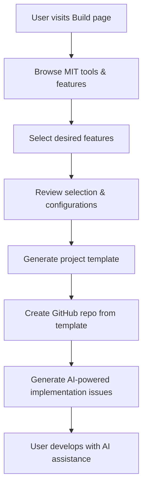

# Build.md - Open Source Tool Builder Feature

## Overview

The Build page is the flagship feature of Open Source Builders that enables users to create customized project starters by selecting features from MIT-licensed open source tools. Instead of starting from scratch, users can cherry-pick proven functionality from established tools and automatically generate implementation guides.

**The Value Proposition:**
- Users browse MIT open source tools and their specific features
- Select desired features from multiple tools (e.g., Cal.com's scheduling + Supabase's auth)
- System generates a new repo based on our Next.js/Keystone starter template
- Creates detailed GitHub issues with AI-powered implementation instructions
- Users get a ready-to-develop project with clear feature implementation roadmap

## Core Workflow



## Database Schema Integration

Our existing Keystone models perfectly support this feature:

### Core Models Used

**Tool Model** (`features/keystone/models/Tool.ts`)
- Filter by `isOpenSource: true` and `license: "MIT"`
- Use `name`, `slug`, `description`, `repositoryUrl`
- Leverage `githubStars` for popularity sorting
- Connect via `category` for browsing

**Feature Model** (`features/keystone/models/Feature.ts`)
- Features categorized by `featureType` (core, integration, ui_ux, api, etc.)
- Rich descriptions for user understanding
- Connected to tools via `ToolFeature` junction

**ToolFeature Model** (`features/keystone/models/ToolFeature.ts`)
- `qualityScore` (1-10) for feature implementation quality
- `implementationNotes` for technical details
- `verified` flag for quality assurance

**Category Model** (`features/keystone/models/Category.ts`)
- Organize tools and features hierarchically
- Icons and colors for UI presentation

## Feature Slice Architecture

### Directory Structure
```
features/
└── build/
    ├── actions/
    │   ├── getMitTools.ts           # Fetch MIT open source tools
    │   ├── getToolFeatures.ts       # Get features for selected tools
    │   ├── generateProject.ts       # Create GitHub repo from template
    │   └── generatePrompt.ts        # Create AI implementation prompt
    ├── components/
    │   ├── BuildWizard.tsx          # Multi-step wizard container
    │   ├── ToolSelector.tsx         # Browse and select MIT tools
    │   ├── FeatureSelector.tsx      # Select features from chosen tools
    │   ├── ProjectPreview.tsx       # Review selections before generation
    │   ├── PromptPreview.tsx        # Show generated AI prompt
    │   └── ProgressTracker.tsx      # Visual step indicator
    ├── lib/
    │   ├── promptTemplates.ts       # AI prompt generation templates
    │   ├── githubTemplate.ts        # GitHub repo template handling
    │   └── featureAnalysis.ts       # Feature compatibility analysis
    ├── screens/
    │   └── BuildPage.tsx            # Main build page component
    └── types/
        └── build.ts                 # TypeScript interfaces
```

## UI Components Design

### 1. BuildWizard Component
Multi-step wizard with clear progress indication:
- Step 1: Tool Selection
- Step 2: Feature Selection  
- Step 3: Project Configuration
- Step 4: Review & Generate

### 2. ToolSelector Component
```tsx
interface ToolSelectorProps {
  onToolsSelect: (tools: Tool[]) => void
  selectedTools: Tool[]
  categories: Category[]
}

// Features:
// - Filter by category
// - Search by name/description
// - Sort by popularity (GitHub stars)
// - MIT license badge display
// - Tool cards with repo links
// - Multi-select with visual feedback
```

### 3. FeatureSelector Component
```tsx
interface FeatureSelectorProps {
  selectedTools: Tool[]
  onFeaturesSelect: (features: SelectedFeature[]) => void
  selectedFeatures: SelectedFeature[]
}

// Features:
// - Grouped by feature type
// - Quality score indicators
// - Implementation complexity hints
// - Conflict detection between features
// - Dependency suggestions
```

### 4. ProjectPreview Component
```tsx
interface ProjectPreviewProps {
  projectName: string
  selectedFeatures: SelectedFeature[]
  onProjectNameChange: (name: string) => void
  onGenerate: () => void
}

// Features:
// - Project naming
// - Feature summary
// - Estimated complexity
// - Generated prompt preview
```

## GraphQL Queries

### Get MIT Open Source Tools
```graphql
query GetMitTools($categoryId: ID) {
  tools(where: { 
    AND: [
      { isOpenSource: { equals: true } }
      { license: { equals: "MIT" } }
      { category: { id: { equals: $categoryId } } }
    ]
  }, orderBy: { githubStars: desc }) {
    id
    name
    slug
    description
    repositoryUrl
    githubStars
    simpleIconSlug
    simpleIconColor
    category {
      name
      color
    }
    features {
      feature {
        id
        name
        description
        featureType
      }
      qualityScore
      implementationNotes
      verified
    }
  }
}
```

### Get Tool Features with Quality Metrics
```graphql
query GetToolFeatures($toolIds: [ID!]!) {
  toolFeatures(where: { 
    tool: { id: { in: $toolIds } } 
    verified: { equals: true }
  }, orderBy: { qualityScore: desc }) {
    id
    tool {
      id
      name
      repositoryUrl
    }
    feature {
      id
      name
      description
      featureType
    }
    qualityScore
    implementationNotes
    verified
  }
}
```

## Prompt Template System

### Base Template Structure
```typescript
interface PromptTemplate {
  introduction: string          // About Next.js/Keystone starter
  projectContext: string        // User's project goals
  toolAnalysis: ToolSection[]   // Each selected tool analysis
  implementation: ImplementationPlan
  resources: Resource[]         // Documentation links
}

interface ToolSection {
  toolName: string
  repositoryUrl: string
  selectedFeatures: FeatureDetail[]
  analysisNotes: string
}

interface FeatureDetail {
  featureName: string
  description: string
  implementationComplexity: 'low' | 'medium' | 'high'
  dependencies: string[]
  codeReferences: string[]      // Specific file/function references
}
```

### Example Generated Prompt
```markdown
# Implementation Request: Custom Project Starter

## Project Overview
You are helping implement a custom web application based on the Next.js/Keystone starter template. This template provides:

- **Next.js 15** with App Router
- **Keystone.js 6** for backend/admin
- **Prisma** for database management
- **Tailwind CSS** for styling
- **TypeScript** throughout
- **GraphQL API** with auto-generated types

## Selected Features to Implement

### From Cal.com (https://github.com/calcom/cal.com)
**Feature: Event Scheduling System**
- Quality Score: 9/10
- Complexity: High
- Key Components: Calendar integration, booking flow, timezone handling
- Reference Files: 
  - `apps/web/components/booking/` (booking flow)
  - `packages/lib/slots.ts` (availability logic)
  - `apps/web/pages/api/book/` (booking API)

**Implementation Notes:**
The Cal.com scheduling system is highly sophisticated. Focus on adapting their core booking logic and calendar integration patterns. Pay special attention to their timezone handling and availability slot calculation algorithms.

### From Supabase (https://github.com/supabase/supabase)
**Feature: Authentication System**
- Quality Score: 10/10  
- Complexity: Medium
- Key Components: Multi-provider auth, session management, RLS policies
- Reference Files:
  - `examples/auth/` (auth examples)
  - `packages/auth-js/` (auth library)

## Implementation Plan

1. **Setup Phase**
   - Review Next.js/Keystone starter structure
   - Plan database schema extensions for selected features
   - Identify integration points

2. **Feature Implementation**
   - Implement Cal.com scheduling system adaptation
   - Integrate Supabase auth patterns with Keystone
   - Ensure features work together harmoniously

3. **Testing & Integration**
   - Test feature interactions
   - Validate against Keystone patterns
   - Ensure TypeScript compliance

## Resources
- [Next.js Documentation](https://nextjs.org/docs)
- [Keystone.js Documentation](https://keystonejs.com/docs)
- [Cal.com Repository](https://github.com/calcom/cal.com)
- [Supabase Repository](https://github.com/supabase/supabase)

Please implement these features step by step, following the existing codebase patterns and maintaining compatibility with the Keystone.js architecture.
```

## GitHub Integration

### Template Repository Creation
```typescript
interface GitHubTemplateConfig {
  templateRepo: 'opensource-builders/nextjs-keystone-starter'
  newRepoName: string
  isPrivate: boolean
  includeAllBranches: false
}

// Process:
// 1. Create new repo from template via GitHub API
// 2. Clone locally for issue creation
// 3. Generate implementation issues
// 4. Push issues to new repo
// 5. Return repo URL to user
```

### Issue Generation
```typescript
interface GeneratedIssue {
  title: string
  body: string              // Generated from prompt template
  labels: string[]          // ['enhancement', 'ai-implementation']
  assignees?: string[]      // Optional: assign to repo owner
}

// Example Issue:
// Title: "Implement Cal.com Event Scheduling System"
// Body: Full prompt with context, references, and implementation plan
// Labels: ['enhancement', 'feature-request', 'ai-ready']
```

## Feature Compatibility Analysis

### Conflict Detection
```typescript
interface FeatureConflict {
  feature1: string
  feature2: string
  conflictType: 'dependency' | 'incompatible' | 'overlapping'
  resolution?: string
}

// Examples:
// - Two different auth systems = incompatible
// - Database schema conflicts = overlapping
// - Missing prerequisites = dependency
```

### Dependency Resolution
```typescript
interface FeatureDependency {
  featureId: string
  dependsOn: string[]
  optional: boolean
  autoInclude: boolean
}

// Example: Scheduling system needs calendar integration
// Example: Payment features need authentication
```

## User Experience Flow

### 1. Landing on Build Page
- Hero section explaining the concept
- Call-to-action: "Start Building"
- Examples of popular feature combinations
- Testimonials/success stories

### 2. Tool Selection Phase
- Category-based browsing (Development, APIs, UI/UX, etc.)
- Search and filter capabilities
- Tool cards with key metrics:
  - GitHub stars
  - Last updated
  - Feature count
  - Implementation quality

### 3. Feature Selection Phase
- Feature cards grouped by tool
- Quality indicators and complexity hints
- Real-time conflict detection
- Dependency suggestions
- Implementation effort estimates

### 4. Project Configuration
- Project naming
- Repository settings (public/private)
- Additional customization options
- Review selected features summary

### 5. Generation Phase
- Progress indicator
- Real-time status updates
- Error handling and retry logic
- Success confirmation with links

## Performance Considerations

### Caching Strategy
- Cache MIT tool queries (update hourly)
- Cache feature relationships
- Preload popular tool combinations
- CDN for tool icons and assets

### Optimization Techniques
- Lazy loading for feature details
- Virtual scrolling for large tool lists
- Debounced search inputs
- Progressive enhancement

## Security & Privacy

### Data Handling
- No personal data storage during selection
- GitHub integration requires OAuth
- Generated repos respect user privacy settings
- Optional analytics with consent

### GitHub Permissions
- Minimal scope: repo creation only
- Clear permission explanations
- Easy disconnection process
- No access to existing repositories

## Analytics & Insights

### User Behavior Tracking
- Popular tool combinations
- Feature selection patterns
- Completion rates by step
- Most successful implementations

### Success Metrics
- Repository generation success rate
- User retention and repeat usage
- Feature implementation completion
- Community feedback and ratings

## Future Enhancements

### Phase 2 Features
- **Community Templates**: User-submitted feature combinations
- **Success Stories**: Showcase completed implementations
- **Feature Ratings**: Community-driven quality scores
- **Implementation Guides**: Step-by-step tutorials

### Phase 3 Features
- **AI Code Generation**: Actual code implementation
- **Live Preview**: Sandbox environment for testing
- **Team Collaboration**: Share and collaborate on builds
- **Marketplace Integration**: Monetization for premium features

## Implementation Timeline

### Week 1-2: Foundation
- Set up feature slice architecture
- Implement basic GraphQL queries
- Create core UI components
- Design prompt template system

### Week 3-4: Core Features
- Build tool selection interface
- Implement feature selection logic
- Create GitHub integration
- Add prompt generation

### Week 5-6: Polish & Testing
- Add conflict detection
- Implement caching
- User testing and feedback
- Performance optimization

### Week 7-8: Launch Preparation
- Security review
- Documentation completion
- Analytics setup
- Marketing preparation

## Technical Debt Considerations

### Immediate Concerns
- Prompt template maintenance as tools evolve
- GitHub API rate limiting
- Feature compatibility matrix updates
- Tool data freshness

### Long-term Maintenance
- Automated tool scanning for new features
- Community contribution system
- Scalability planning for high usage
- Integration with other platforms (GitLab, etc.)

---

**This build feature represents the core innovation of Open Source Builders - transforming how developers discover, evaluate, and integrate proven open source solutions into their projects.**